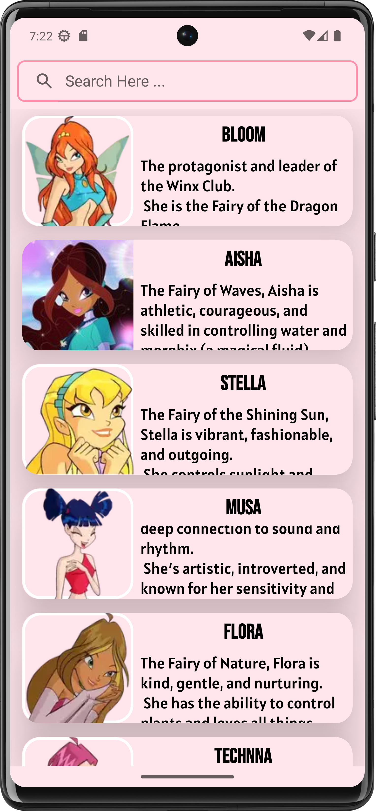
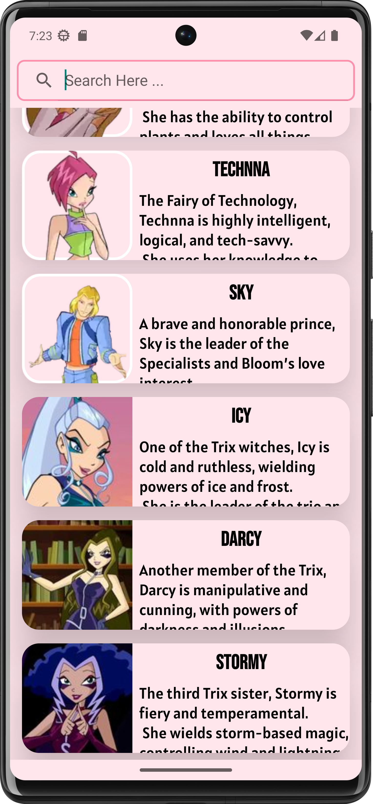
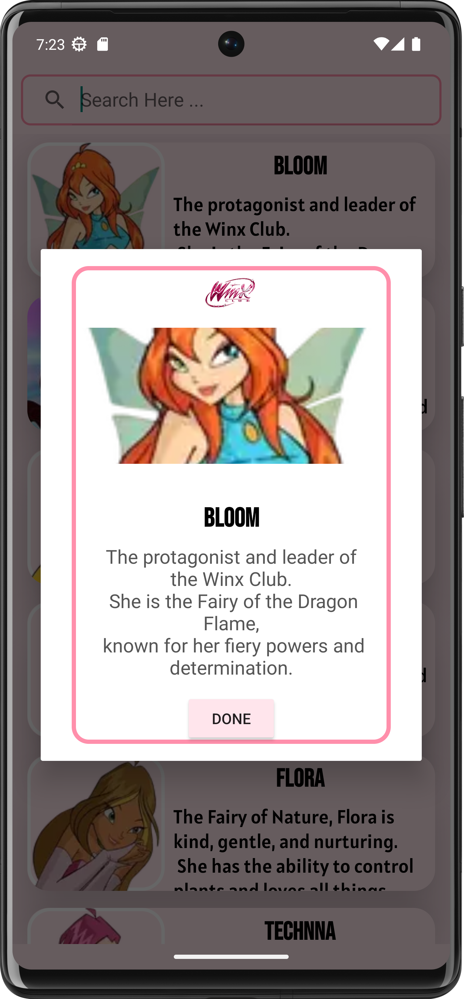
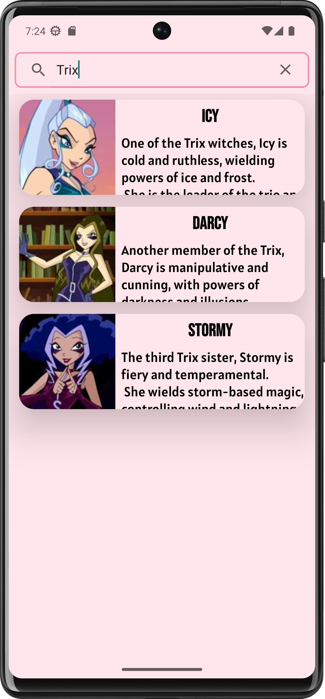

#  TV Characters

This project is an Android application that displays a list of my favorite TV show characters - Winx 💫.
Users can search for characters by name or description.

## 🌟 Features

- Display a list of TV characters using a RecyclerView
- Each character has:
    - ✅ A picture 🖼️
    - ✅ A short description 📖
    - ✅ A clickable feature that displays a custom alert message when tapped! 👆✨
- Search functionality to filter characters by name or description

## 🤖 Technologies Used

- Java
- XML
- Android Studio
- Material Design Components
- Android SDK

## 🛠️Setup
### Prerequisites
- Android Studio installed on your machine.
### Installation

1. Clone the repository:
   ```sh
   git clone https://github.com/fannypil/tvCharacters.git
   ```
2. Open the project in Android Studio.
3. Build and run the project on an emulator or a physical device.

## 📸 Screenshots
### Main Screen
 

### Character Details


### Search Functionality


## Acknowledgements
- This project was developed as part of an Development in android environment 1 coursework.
- [Material Design Components](https://material.io/develop/android/docs/getting-started)
- [Android Developers](https://developer.android.com/docs)
